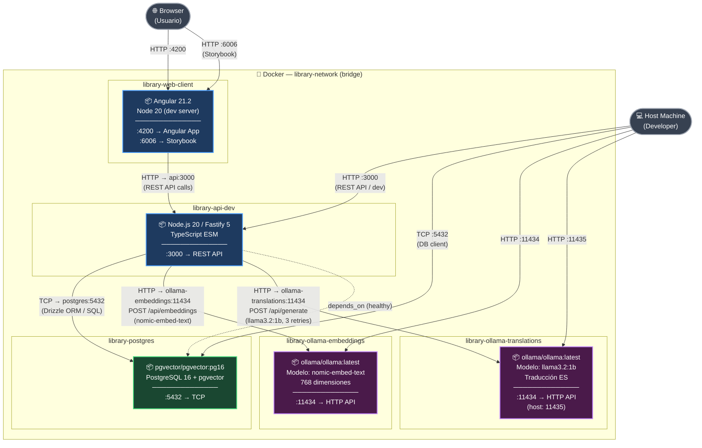

# Diagrama de Infraestructura — Servicios del Sistema

Este diagrama representa la infraestructura de despliegue del sistema **Library** en entorno de desarrollo. Muestra los 5 contenedores Docker que componen el sistema, sus tecnologías base, los puertos expuestos al host y las dependencias de comunicación entre ellos dentro de la red Docker interna `library-network`.

## Notas

| Servicio | Imagen base | Puerto host | Puerto interno | Red interna |
|---|---|---|---|---|
| `library-web-client` | Node 20 (custom) | 4200, 6006 | 4200, 6006 | `web-client:4200` |
| `library-api-dev` | Node 20 (custom) | 3000 | 3000 | `api:3000` |
| `library-postgres` | `pgvector/pgvector:pg16` | 5432 | 5432 | `postgres:5432` |
| `library-ollama-embeddings` | `ollama/ollama:latest` | 11434 | 11434 | `ollama-embeddings:11434` |
| `library-ollama-translations` | `ollama/ollama:latest` | 11435 | 11434 | `ollama-translations:11434` |

> **Nota sobre Ollama Translations**: el puerto interno del contenedor es siempre `11434` (puerto por defecto de Ollama), pero se mapea al puerto `11435` del host para evitar conflictos con el servicio de embeddings.
