# Diagrama de Arquitectura — API (Hexagonal + DDD)

Este diagrama representa la arquitectura interna de la API del sistema **Library**. Está construida siguiendo los principios de **Arquitectura Hexagonal (Ports & Adapters)** y **Domain-Driven Design (DDD)**.

La regla fundamental de dependencias es: **las capas externas dependen de las internas, nunca al revés**. El dominio no conoce nada del exterior.

```mermaid
graph LR
    %% ═══════════════════════════════════════════════════════════
    %% DRIVER (entrada) — adaptador HTTP
    %% ═══════════════════════════════════════════════════════════
    subgraph DRIVER["🔌 Infrastructure — Driver (HTTP Adapter)"]
        direction TB
        Fastify["⚡ Fastify Server\nserver.ts"]
        Routes["📋 Routes\nbooks.routes\nbook-types.routes\ncategories.routes\nbook-levels.routes"]
        Controllers["🎮 Controllers\nBooksController\nSearchBooksController\nBookTypesController\nCategoriesController\nBookLevelsController"]
        ZodSchemas["🔍 Zod Schemas\n(validación / serialización)"]
        HttpErrorMapper["❌ HttpErrorMapper\n(domain → HTTP errors)"]
    end

    %% ═══════════════════════════════════════════════════════════
    %% APPLICATION — casos de uso + puertos
    %% ═══════════════════════════════════════════════════════════
    subgraph APPLICATION["🧩 Application Layer"]
        direction TB

        subgraph UseCases["Use Cases"]
            UC1["CreateBookUseCase"]
            UC2["SearchBooksUseCase"]
            UC3["ListBookTypesUseCase"]
            UC4["ListCategoriesUseCase"]
            UC5["ListBookLevelsUseCase"]
        end

        subgraph Ports["Output Ports (Interfaces)"]
            direction TB
            P1["📦 BookRepository"]
            P2["📦 AuthorRepository"]
            P3["📦 CategoryRepository"]
            P4["📦 TypeRepository"]
            P5["📦 LevelRepository"]
            P6["🤖 EmbeddingService"]
            P7["🌐 TranslationService"]
            P8["📝 Logger"]
        end

        AppErrors["⚠️ ApplicationErrors\nEmbeddingServiceUnavailableError\nTranslationServiceUnavailableError"]
    end

    %% ═══════════════════════════════════════════════════════════
    %% DOMAIN — núcleo de negocio, sin dependencias externas
    %% ═══════════════════════════════════════════════════════════
    subgraph DOMAIN["🏛️ Domain Layer (Pure TypeScript — No External Dependencies)"]
        direction TB

        subgraph Entities["Entities"]
            E1["📖 Book\n(Aggregate Root)"]
            E2["✍️ Author"]
            E3["🏷️ BookType"]
            E4["📂 Category"]
            E5["📊 Level"]
        end

        subgraph ValueObjects["Value Objects"]
            VO1["🔢 ISBN\n(ISBN-10 / ISBN-13\nwith checksum)"]
            VO2["📄 BookFormat\n(epub/pdf/mobi/\nazw3/djvu/cbz/\ncbr/txt/other)"]
        end

        subgraph CriteriaPattern["Criteria Pattern"]
            CR["Criteria\nFilters · Filter\nFilterField · FilterOperator\nFilterValue · Order\nOrderBy · OrderType"]
        end

        DomainErrors["⚠️ DomainErrors\nRequiredFieldError\nFieldTooLongError\nInvalidUUIDError\nDuplicateItemError\nBookNotFoundError\nDuplicateISBNError\nDuplicateBookError\nInvalidBookTypeError\nCategoryTypeMismatchError\nLevelTypeMismatchError\nInvalidLanguageCodeError\nEmbeddingTextTooLongError"]

        Validators["✅ Validators\nvalidateId · isValidUUID"]
    end

    %% ═══════════════════════════════════════════════════════════
    %% DRIVEN (salida) — adaptadores de infraestructura
    %% ═══════════════════════════════════════════════════════════
    subgraph DRIVEN["🔌 Infrastructure — Driven Adapters"]
        direction TB

        subgraph Persistence["Persistence (Drizzle ORM)"]
            R1["🗄️ PostgresBookRepository"]
            R2["🗄️ PostgresAuthorRepository"]
            R3["🗄️ PostgresCategoryRepository"]
            R4["🗄️ PostgresTypeRepository"]
            R5["🗄️ PostgresLevelRepository"]
            Schema["📐 Drizzle Schema\ntypes · levels · type_levels\nauthors · categories\nbooks · book_authors\nbook_categories"]
            Mappers["🔄 Mappers\nBookMapper · AuthorMapper\nCategoryMapper · LevelMapper\nTypeMapper"]
        end

        subgraph AIAdapters["AI Services"]
            OE["🤖 OllamaEmbeddingService\n(nomic-embed-text\n768 dims, POST /api/embeddings)"]
            OT["🌐 OllamaTranslationService\n(llama3.2:1b\nPOST /api/generate\n3 retries + backoff)"]
        end

        PinoLog["📝 PinoLogger"]
    end

    %% ═══════════════════════════════════════════════════════════
    %% EXTERNAL SYSTEMS
    %% ═══════════════════════════════════════════════════════════
    subgraph External["🌍 External Systems"]
        PostgreSQL[("🐘 PostgreSQL 16\n+ pgvector")]
        OllamaEmb(["🧠 Ollama Embeddings\n:11434"])
        OllaTrans(["🧠 Ollama Translations\n:11434"])
    end

    %% ═══════════════════════════════════════════════════════════
    %% COMPOSITION ROOT
    %% ═══════════════════════════════════════════════════════════
    Bootstrap["🚀 server.ts\n(Composition Root / DI)"]

    %% ═══════════════════════════════════════════════════════════
    %% FLUJO DE DEPENDENCIAS (de afuera hacia adentro)
    %% ═══════════════════════════════════════════════════════════

    %% Driver → Application
    Fastify --> Routes
    Routes --> Controllers
    Controllers --> ZodSchemas
    Controllers --> UC1 & UC2 & UC3 & UC4 & UC5
    Controllers --> HttpErrorMapper

    %% Application → Domain
    UC1 & UC2 --> E1
    UC1 --> P1 & P6 & P7
    UC2 --> P1
    UC3 --> P4
    UC4 --> P3
    UC5 --> P5

    %% Domain interno
    E1 --> VO1 & VO2
    E1 --> DomainErrors

    %% Driven implementa los puertos de Application
    R1 -.->|"implements"| P1
    R2 -.->|"implements"| P2
    R3 -.->|"implements"| P3
    R4 -.->|"implements"| P4
    R5 -.->|"implements"| P5
    OE -.->|"implements"| P6
    OT -.->|"implements"| P7
    PinoLog -.->|"implements"| P8

    %% Driven → External
    R1 & R2 & R3 & R4 & R5 --> Schema
    R1 & R2 & R3 & R4 & R5 --> Mappers
    R1 & R2 & R3 & R4 & R5 --> PostgreSQL
    OE --> OllamaEmb
    OT --> OllaTrans

    %% Composition Root ensambla todo
    Bootstrap -.->|"wires"| Controllers
    Bootstrap -.->|"wires"| R1 & R2 & R3 & R4 & R5
    Bootstrap -.->|"wires"| OE & OT & PinoLog

    %% ═══════════════════════════════════════════════════════════
    %% ESTILOS
    %% ═══════════════════════════════════════════════════════════
    classDef domain      fill:#1a3a5c,stroke:#4a9eff,stroke-width:2px,color:#fff
    classDef application fill:#1a4731,stroke:#4ade80,stroke-width:2px,color:#fff
    classDef driver      fill:#4a2d00,stroke:#fbbf24,stroke-width:2px,color:#fff
    classDef driven      fill:#3d1a5c,stroke:#c084fc,stroke-width:2px,color:#fff
    classDef external    fill:#374151,stroke:#9ca3af,stroke-width:2px,color:#fff
    classDef bootstrap   fill:#5c1a1a,stroke:#f87171,stroke-width:2px,color:#fff

    class E1,E2,E3,E4,E5,VO1,VO2,CR,DomainErrors,Validators domain
    class UC1,UC2,UC3,UC4,UC5,P1,P2,P3,P4,P5,P6,P7,P8,AppErrors application
    class Fastify,Routes,Controllers,ZodSchemas,HttpErrorMapper driver
    class R1,R2,R3,R4,R5,Schema,Mappers,OE,OT,PinoLog driven
    class PostgreSQL,OllamaEmb,OllaTrans external
    class Bootstrap bootstrap
```



## Regla de dependencias

```
HTTP Request
     │
     ▼
[Infrastructure Driver]  →  [Application]  →  [Domain]
     │                            │
     ▼                            ▼
[Infrastructure Driven]  implements [Ports]
     │
     ▼
[External Systems (DB, Ollama)]
```

La dirección de las flechas sólidas representa el **flujo de llamadas**. Las flechas punteadas representan relaciones de **implementación de interfaces** (Dependency Inversion Principle). El dominio nunca importa nada de las capas externas.

## Componentes clave por capa

| Capa | Responsabilidad | Dependencias externas |
|---|---|---|
| **Domain** | Lógica de negocio pura, entidades, value objects, reglas de dominio | **Ninguna** |
| **Application** | Orquesta casos de uso, define puertos (interfaces) | Solo el Domain |
| **Infrastructure Driver** | Adapta peticiones HTTP al lenguaje de la aplicación | Application (Use Cases) |
| **Infrastructure Driven** | Implementa los puertos: DB, IA, logging | PostgreSQL, Ollama, Pino |
| **Composition Root** | Ensambla e inyecta todas las dependencias | Todo |
