# Diagrama de Arquitectura — Web Client (Angular 21.2)

Este diagrama representa la arquitectura interna del cliente web del sistema **Library**, construido con Angular 21.2. La estructura sigue el patrón **Screaming Architecture** (organización por features), con gestión de estado mediante **Angular Signals** y comunicación con la API REST a través de servicios singleton en el módulo `core`.

```mermaid
graph TD
    %% ═══════════════════════════════════════════════════════════
    %% EXTERNAL
    %% ═══════════════════════════════════════════════════════════
    API(["🔌 Library REST API\nhttp://api:3000"])
    User(["👤 Usuario\n(Browser)"])

    %% ═══════════════════════════════════════════════════════════
    %% APP BOOTSTRAP
    %% ═══════════════════════════════════════════════════════════
    subgraph Bootstrap["🚀 App Bootstrap"]
        AppConfig["app.config.ts\n(providers, HttpClient,\nPrimeNG, Router)"]
        AppRoutes["app.routes.ts\n/ → MainLayout\n/books → CatalogFeature (lazy)\n** → redirect /books"]
    end

    %% ═══════════════════════════════════════════════════════════
    %% LAYOUT
    %% ═══════════════════════════════════════════════════════════
    subgraph Layout["🖼️ Layout"]
        MainLayout["MainLayoutComponent\n(router-outlet)"]
        Header["HeaderComponent\n(nav + ThemeToggle)"]
        Footer["FooterComponent"]
        ThemeToggle["ThemeToggleComponent\n(Shared)"]
    end

    %% ═══════════════════════════════════════════════════════════
    %% CORE — Singleton Services (providedIn: root)
    %% ═══════════════════════════════════════════════════════════
    subgraph Core["⚙️ Core — Singleton Services"]
        direction TB

        ApiService["🌐 ApiService\n(HttpClient wrapper\nbase URL config)"]

        BookService["📚 BookService\n(HTTP calls:\nGET /api/books\nGET /api/book-types\nGET /api/book-categories\nGET /api/book-levels)"]

        subgraph Store["🔄 BookSearchStore (Angular Signals)"]
            direction LR
            SigBooks["books Signal\n(Book[])"]
            SigLoading["isLoading Signal\n(boolean)"]
            SigError["error Signal\n(string | null)"]
            SigFilters["filters Signal\n(SearchFilters)"]
            SigPagination["pagination Signal\n(cursor, hasMore)"]
            SigMeta["types / categories\nlevels Signals"]
        end

        ThemeService["🎨 ThemeService\n(dark/light mode\nLocalStorage)"]
        KindleService["📱 KindleService\n(send-to-Kindle flow)"]
        DialogService["💬 DialogService\n(PrimeNG DynamicDialog)"]
    end

    %% ═══════════════════════════════════════════════════════════
    %% CATALOG FEATURE (lazy-loaded at /books)
    %% ═══════════════════════════════════════════════════════════
    subgraph Catalog["📖 Catalog Feature (lazy — /books)"]
        direction TB

        BookListPage["BookListPageComponent\n(Page / Smart Component)"]

        subgraph Filters["🔍 Filter Components"]
            FilterPanel["FilterPanelComponent"]
            SemanticSearch["SemanticSearchComponent"]
            TextFilterInput["TextFilterInputComponent"]
            SearchableSelect["SearchableSelectComponent"]
            MultiSelectChips["MultiSelectChipsComponent"]
        end

        subgraph Table["📋 Table Components"]
            BookTable["BookTableComponent"]
            BookCard["BookCardComponent"]
            Paginator["PaginatorComponent"]
            LoadingOverlay["LoadingOverlayComponent"]
            EmptyState["EmptyStateComponent"]
        end

        subgraph DataDisplay["🏷️ Data Display Components"]
            CategoryChips["CategoryChipsComponent"]
            FormatIcon["FormatIconComponent"]
            LanguageFlag["LanguageFlagComponent"]
            LevelBadge["LevelBadgeComponent"]
            TruncatedText["TruncatedTextComponent"]
        end

        subgraph Dialogs["💬 Dialogs"]
            BookDescDialog["BookDescriptionDialogComponent"]
            SendKindleDialog["SendToKindleDialogComponent"]
        end
    end

    %% ═══════════════════════════════════════════════════════════
    %% SHARED
    %% ═══════════════════════════════════════════════════════════
    subgraph Shared["🔧 Shared"]
        ThemeToggleShared["ThemeToggleComponent\n(header)"]
    end

    %% ═══════════════════════════════════════════════════════════
    %% KINDLE FEATURE (placeholder)
    %% ═══════════════════════════════════════════════════════════
    subgraph Kindle["📱 Kindle Feature"]
        KindlePlaceholder["(en desarrollo)"]
    end

    %% ═══════════════════════════════════════════════════════════
    %% CONEXIONES
    %% ═══════════════════════════════════════════════════════════

    %% Usuario → App
    User -->|"HTTP :4200"| AppConfig

    %% Bootstrap
    AppConfig --> AppRoutes
    AppRoutes --> MainLayout

    %% Layout
    MainLayout --> Header & Footer
    Header --> ThemeToggleShared
    Header --> ThemeService
    MainLayout -->|"router-outlet"| BookListPage

    %% Page → Store
    BookListPage -->|"reads signals"| Store
    BookListPage -->|"dispatches actions"| Store

    %% Page → Components
    BookListPage --> FilterPanel
    BookListPage --> BookTable
    FilterPanel --> SemanticSearch & TextFilterInput & SearchableSelect & MultiSelectChips
    BookTable --> BookCard & Paginator & LoadingOverlay & EmptyState
    BookCard --> CategoryChips & FormatIcon & LanguageFlag & LevelBadge & TruncatedText
    BookCard -->|"opens"| BookDescDialog
    BookCard -->|"opens via DialogService"| SendKindleDialog

    %% Store → Services
    Store -->|"calls"| BookService
    Store -->|"reads state"| SigBooks & SigLoading & SigError & SigFilters & SigPagination & SigMeta
    SendKindleDialog -->|"calls"| KindleService

    %% Services → API
    BookService -->|"delegates HTTP"| ApiService
    ApiService -->|"HTTP GET /api/books\nGET /api/book-types\nGET /api/book-categories\nGET /api/book-levels"| API

    %% Estilos
    classDef page      fill:#1a3a5c,stroke:#4a9eff,stroke-width:2px,color:#fff
    classDef service   fill:#1a4731,stroke:#4ade80,stroke-width:2px,color:#fff
    classDef signal    fill:#2d1a4a,stroke:#c084fc,stroke-width:2px,color:#fff
    classDef component fill:#4a2d00,stroke:#fbbf24,stroke-width:2px,color:#fff
    classDef layout    fill:#1a3030,stroke:#2dd4bf,stroke-width:2px,color:#fff
    classDef external  fill:#374151,stroke:#9ca3af,stroke-width:2px,color:#fff
    classDef bootstrap fill:#5c1a1a,stroke:#f87171,stroke-width:2px,color:#fff

    class BookListPage page
    class ApiService,BookService,ThemeService,KindleService,DialogService service
    class Store,SigBooks,SigLoading,SigError,SigFilters,SigPagination,SigMeta signal
    class FilterPanel,SemanticSearch,TextFilterInput,SearchableSelect,MultiSelectChips,BookTable,BookCard,Paginator,LoadingOverlay,EmptyState,CategoryChips,FormatIcon,LanguageFlag,LevelBadge,TruncatedText,BookDescDialog,SendKindleDialog component
    class MainLayout,Header,Footer,ThemeToggle,ThemeToggleShared layout
    class API,User external
    class AppConfig,AppRoutes bootstrap
```



## Patrón de estado con Angular Signals

El `BookSearchStore` es el corazón del estado de la aplicación. No usa NgRx — gestiona el estado con **Angular Signals** nativos:

```
Usuario interactúa con FilterPanel / SemanticSearch
         │
         ▼
BookListPage llama a BookSearchStore.search(filters)
         │
         ▼
BookSearchStore actualiza signals (isLoading = true)
         │
         ▼
BookSearchStore llama a BookService.searchBooks(params)
         │
         ▼
BookService llama a ApiService.get('/api/books', params)
         │
         ▼
ApiService → HTTP GET → Library REST API
         │
         ▼
BookSearchStore actualiza signals (books, pagination, isLoading = false)
         │
         ▼
BookListPage y sus componentes hijos re-renderizan reactivamente
```

## Estructura de features

| Feature | Ruta | Carga | Descripción |
|---|---|---|---|
| `catalog` | `/books` | Lazy | Búsqueda y visualización del catálogo de libros |
| `kindle` | *(en desarrollo)* | Lazy | Envío de libros a Kindle |
| `layout` | Siempre activo | Eager | Estructura visual: header, footer, layout principal |
| `core` | Siempre activo | Eager | Servicios singleton: API, estado, tema, Kindle |
| `shared` | Siempre activo | Eager | Componentes y utilidades reutilizables |
