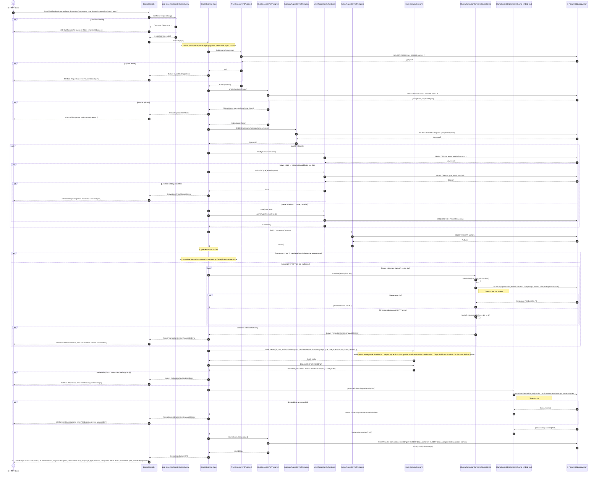

# Diagrama de Flujo — Creación de un Libro (End-to-End)

Este diagrama de secuencia representa el flujo completo de creación de un libro en el sistema **Library**. Es el flujo más complejo del sistema, ya que involucra validaciones de dominio, traducción automática de descripciones a español, generación de embeddings vectoriales y persistencia atómica en PostgreSQL.



## Resumen del flujo

| Paso | Descripción | Error posible |
|---|---|---|
| 1 | Validación HTTP (Zod) | `400 Bad Request` |
| 2 | Validar tipo de libro existe en DB | `400 InvalidBookTypeError` |
| 3 | Detectar duplicado por ISBN | `409 DuplicateISBNError` |
| 4 | Resolver/crear categorías (scoped al tipo) | — |
| 5 | Resolver/crear nivel y validar compatibilidad con tipo | `400 LevelTypeMismatchError` |
| 6 | Resolver/crear autores | — |
| 7 | Traducir descripción a español (si language ≠ 'es') | `503 TranslationServiceUnavailableError` |
| 8 | Crear entidad `Book` (validaciones de dominio) | `400 DomainError` |
| 9 | Validar longitud del texto de embedding (max 7000) | `400 EmbeddingTextTooLongError` |
| 10 | Generar embedding vectorial (768 dims) | `503 EmbeddingServiceUnavailableError` |
| 11 | Persistir libro + autores + categorías + embedding (atómico) | `500 Internal Server Error` |

## Comportamiento de retry en traducción

El `OllamaTranslationService` implementa reintentos con **backoff exponencial**:

```
Intento 1 → falla → espera 1s
Intento 2 → falla → espera 2s
Intento 3 → falla → TranslationServiceUnavailableError
```

> **Nota**: Si el libro ya viene con `translatedDescription` (caso de carga masiva por script), se salta completamente el paso de traducción y se usa la descripción pre-proporcionada.
